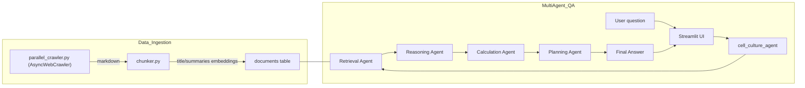

# 🧪 Ask Agar: An Agentic RAG Pipeline for Cell Culture Protocols

This project implements a **multi-agent Retrieval-Augmented Generation (RAG) system** designed to provide expert advice on cell culture techniques and knowledge. The web crawler automatically finds relevant websites, scrapes and stores the information in a vector database, and the AI agents make decisions on how to use all of this knowledge to generate context-aware, accurate responses to user queries.




There are four AI agents that cooperate to produce the final answer:

1. **Retrieval Agent**: This agent queries the vector database to fetch the most relevant documents based on the user's input. The agent is configured to work with multiple vector databases.

2. **Reasoning Agent**: This agent consumes retrieved passages from the Retrieval Agent along with the user's question to generate intermediate explanations.

3. **Calculation Agent**: This agent handles quantitative tasks such as unit conversions or statistical operations that support the reasoning process.

4. **Planning Agent**: This agent orchestrates the overall workflow by synthesizing information from each agent and composing their outputs into the final answer.

## Demo Videos

Here are some sample questions! Click through to see videos of the high-quality responses from the Streamlit demo.

<details>
  <summary>Design a dose–response experiment for a new anti-cancer compound in cell culture.</summary>
  

https://github.com/user-attachments/assets/0afd6a5c-3934-4a1b-af58-d73d12ff2bcc


</details>

<details>
  <summary>Troubleshoot a repeated contamination scenario.</summary>


https://github.com/user-attachments/assets/923c7dc5-f8e2-4ae5-825b-b21fd264eb3e


</details>

<details>
  <summary>How would you calculate the volume of cell suspension needed per well and the total number of cells required?</summary>


https://github.com/user-attachments/assets/905b92ed-e037-471e-ac0a-97b48c4996e9


</details> 

<details>
  <summary>Media preparation math</summary>


https://github.com/user-attachments/assets/41034e74-6fe8-4532-8363-a9ced14ba267


</details>

<details>
  <summary>Create experimental plan for creating a stable cell line expressing gene X</summary>


https://github.com/user-attachments/assets/e56fb513-c86d-4ee0-b919-2f732d015112


</details>

<details>
  <summary>Compare two culture models – traditional 2D monolayer vs 3D organoid culture </summary>


https://github.com/user-attachments/assets/48e2a531-ca43-4e3b-9ea5-c9d7062409a1


</details> 

## Environment Setup

To set up the required Python environment using Conda, follow these steps:

1. Make sure you have `Anaconda` (or `Miniconda`) installed and added to your path.

2. Clone this repository and navigate to the project directory.

3. Run the following command from your terminal to create the environment from the included `environment.yml` file.

```powershell
conda env create --file environment.yml
```

4. Activate the environment using: 

```powershell
conda activate cellRAG
```

Now your environment should be ready to use!

<!-- Can insert a terminal recording of environment setup here. -->

### Setup `.env` File

Create a `.env` file with the following:

```python
# OpenAI API credentials
# Will need to create an OpenAI account to generate an API key
OPENAI_API_KEY=
LLM_MODEL="gpt-4o-mini"  # Or your choice of model
EMBEDDING_MODEL="text-embedding-3-small"  # Or your choice of model

# Supabase credentials
# Log in to Supabase online and create a project. 
# The project URL and API keys are available from your project dashboard.
SUPABASE_URL=
SUPABASE_API_KEY=
SUPABASE_SERVICE_KEY=
```

### Important Packages

* `crawl4ai` : Web crawling and data scraping
* `langchain` : Helpful functions for splitting documents and processing chunks
* `supabase` : Store document chunks, metadata, and vector embeddings in a curated knowledge base
* `openai` : Provide a strong pre-trained, instruction-tuned base Large Language Model (LLM) to use
* `pydantic-ai` : Build an Agentic RAG system with defined dependencies and tools
* `streamlit` : Create a beautiful chat UI to interact with the RAG agent

## Data Collection and Processing

To run the data collection, processing, and storage pipeline:

1. Navigate to the `src/data_collection` directory.
2. Run the following command from your terminal:
```powershell
python parallel_crawler.py
```


## Database Setup

Please make sure that you have already created a Supabase account and a New Project. From your Project dashboard, go to the `SQL Editor` tab and paste in the SQL commands from `documents.sql`. 

This will set up the `documents` table with vector storage capabilities and Row-Level Security (RLS). The SQL script also defines the `match_docs` function, which will be used to query the database for relevant documents in the RAG pipeline.

## Run the Agentic RAG Pipeline

Run the Streamlit app using the following command:

```powershell
streamlit run chatbot_ui.py
```

The app will run locally at [http://localhost:8501](http://localhost:8501).

## Further Testing and Optimization

* query rewriting
* relevance feedback
* contextual compression

```
**********************************************************************************************
*    ,---,                        ,-.           ,---,                                        *
*   '  .' \                   ,--/ /|          '  .' \                                       *
*  /  ;    '.               ,--. :/ |         /  ;    '.                             __  ,-. *
* :  :       \    .--.--.   :  : ' /         :  :       \     ,----._,.            ,' ,'/ /| *
* :  |   /\   \  /  /    '  |  '  /          :  |   /\   \   /   /  ' /   ,--.--.  '  | |' | *
* |  :  ' ;.   :|  :  /`./  '  |  :          |  :  ' ;.   : |   :     |  /       \ |  |   ,' *
* |  |  ;/  \   \  :  ;_    |  |   \         |  |  ;/  \   \|   | .\  . .--.  .-. |'  :  /   *
* '  :  | \  \ ,'\  \    `. '  : |. \        '  :  | \  \ ,'.   ; ';  |  \__\/: . .|  | '    *
* |  |  '  '--'   `----.   \|  | ' \ \       |  |  '  '--'  '   .   . |  ," .--.; |;  : |    *
* |  :  :        /  /`--'  /'  : |--'        |  :  :         `---`-'| | /  /  ,.  ||  , ;    *
* |  | ,'       '--'.     / ;  |,'           |  | ,'         .'__/\_: |;  :   .'   \---'     *
* `--''           `--'---'  '--'             `--''           |   :    :|  ,     .-./         *
*                                                             \   \  /  `--`---'             *
*                                                              `--`-'                        *
**********************************************************************************************
```
