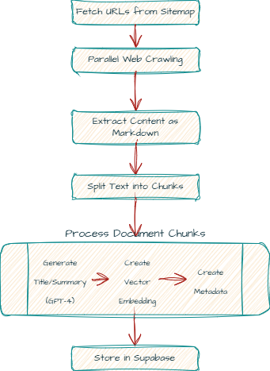

```
**********************************************************************************************
*    ,---,                        ,-.           ,---,                                        *
*   '  .' \                   ,--/ /|          '  .' \                                       *
*  /  ;    '.               ,--. :/ |         /  ;    '.                             __  ,-. *
* :  :       \    .--.--.   :  : ' /         :  :       \     ,----._,.            ,' ,'/ /| *
* :  |   /\   \  /  /    '  |  '  /          :  |   /\   \   /   /  ' /   ,--.--.  '  | |' | *
* |  :  ' ;.   :|  :  /`./  '  |  :          |  :  ' ;.   : |   :     |  /       \ |  |   ,' *
* |  |  ;/  \   \  :  ;_    |  |   \         |  |  ;/  \   \|   | .\  . .--.  .-. |'  :  /   *
* '  :  | \  \ ,'\  \    `. '  : |. \        '  :  | \  \ ,'.   ; ';  |  \__\/: . .|  | '    *
* |  |  '  '--'   `----.   \|  | ' \ \       |  |  '  '--'  '   .   . |  ," .--.; |;  : |    *
* |  :  :        /  /`--'  /'  : |--'        |  :  :         `---`-'| | /  /  ,.  ||  , ;    *
* |  | ,'       '--'.     / ;  |,'           |  | ,'         .'__/\_: |;  :   .'   \---'     *
* `--''           `--'---'  '--'             `--''           |   :    :|  ,     .-./         *
*                                                             \   \  /  `--`---'             *
*                                                              `--`-'                        *
**********************************************************************************************
```
# 🧪 Ask Agar: An Agentic RAG Pipeline for Cell Culture Protocols

This project implements an intelligent Retrieval-Augmented Generation (RAG) agent designed to serve as an expert on cell culture techniques and knowledge. The agent automatically crawls relevant websites, scrapes and stores information in a vector database, and uses this knowledge to answer user queries with context-aware, accurate responses.

## Environment Setup

To set up the required Python environment using Conda, follow these steps:

1. Make sure you have `Anaconda` (or `Miniconda`) installed and added to your path.

2. Clone this repository and navigate to the project directory.

3. Run the following command from your terminal to create the environment from the included `environment.yml` file.

```powershell
conda env create --file environment.yml
```

4. Activate the environment using: 

```powershell
conda activate cellRAG
```

Now your environment should be ready to use!

<!-- Can insert a terminal recording of environment setup here. -->

### Setup `.env` File

Create a `.env` file with the following:

```python
# OpenAI API credentials
# Will need to create an OpenAI account to generate an API key
OPENAI_API_KEY=
LLM_MODEL="gpt-4o-mini"  # Or your choice of model
EMBEDDING_MODEL="text-embedding-3-small"  # Or your choice of model

# Supabase credentials
# Log in to Supabase online and create a project. 
# The project URL and API keys are available from your project dashboard.
SUPABASE_URL=
SUPABASE_API_KEY=
SUPABASE_SERVICE_KEY=
```

### Important Packages

* `crawl4ai` : Web crawling and data scraping
* `langchain` : Helpful functions for splitting documents and processing chunks
* `supabase` : Store document chunks, metadata, and vector embeddings in a curated knowledge base
* `openai` : Provide a strong pre-trained, instruction-tuned base Large Language Model (LLM) to use
* `pydantic-ai` : Build an Agentic RAG system with defined dependencies and tools
* `streamlit` : Create a beautiful chat UI to interact with the RAG agent

## Data Collection and Processing

To run the data collection, processing, and storage pipeline:

1. Navigate to the `src/data_collection` directory.
2. Run the following command from your terminal:
```powershell
python parallel_crawler.py
```



## Database Setup

Please make sure that you have already created a Supabase account and a New Project. From your Project dashboard, go to the `SQL Editor` tab and paste in the SQL commands from `documents.sql`. 

This will set up the `documents` table with vector storage capabilities and Row-Level Security (RLS). The SQL script also defines the `match_docs` function, which will be used to query the database for relevant documents in the RAG pipeline.

## Run the Agentic RAG Pipeline

Run the Streamlit app using the following command:

```powershell
streamlit run chatbot_ui.py
```

The app will run locally at [http://localhost:8501](http://localhost:8501).

## Further Testing and Optimization

If I had more time, I would have liked to explore:
* multiple agents (reviewer agent?)
* more sophisticated tools
* query rewriting
* relevance feedback
* contextual compression
